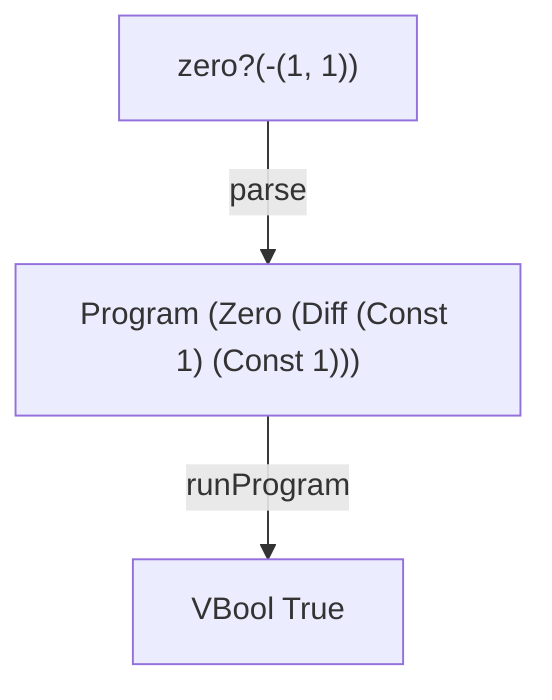

# ZERO

A tiny interpreter in Elm that adds the `zero?` predicate, Boolean values, and runtime type errors.

ZERO builds on [DIFF](https://github.com/tinyinterpreters/diff), where expressions first became recursive. Adding a Boolean-producing expression removes the assumption that every expression evaluates to a number and requires operations to check the values they receive.

Read [ZERO: Adding Booleans and Runtime Type Errors to a Tiny Interpreter in Elm](https://blog.tinyinterpreters.dev/posts/zero) for a guided explanation of how it works.



## Usage

You’ll need [Nix](https://nixos.org/) with flakes enabled.

Enter the development environment and start the Elm REPL:

```bash
$ nix develop
$ elm repl
```

Import the interpreter and run a program:

```elm
> import ZERO.Interpreter as I
> I.run "zero?(-(1, 1))"
```

The program evaluates the difference expression first and then tests whether its result is zero. It succeeds with:

```elm
Ok (VBool True)
```

## Language

ZERO supports non-negative integer constants:

```txt
123
```

difference expressions:

```txt
-(456, 123)
```

and the `zero?` predicate:

```txt
zero?(-(1, 1))
```

The `zero?` predicate evaluates its operand and produces:

* `VBool True` when the result is the number `0`
* `VBool False` when the result is any other number
* a runtime type error when the result is not a number

## Runtime errors

The grammar permits any expression as an operand, but operations still require particular kinds of values.

For example:

```txt
zero?(zero?(0))
```

is valid syntax. However, the inner `zero?` produces a Boolean while the outer `zero?` requires a number, so evaluation fails with a runtime type error.

## Tiny Interpreters

ZERO is part of [Tiny Interpreters](https://blog.tinyinterpreters.dev), a blog about learning how programming languages work by building small interpreters in Elm.
