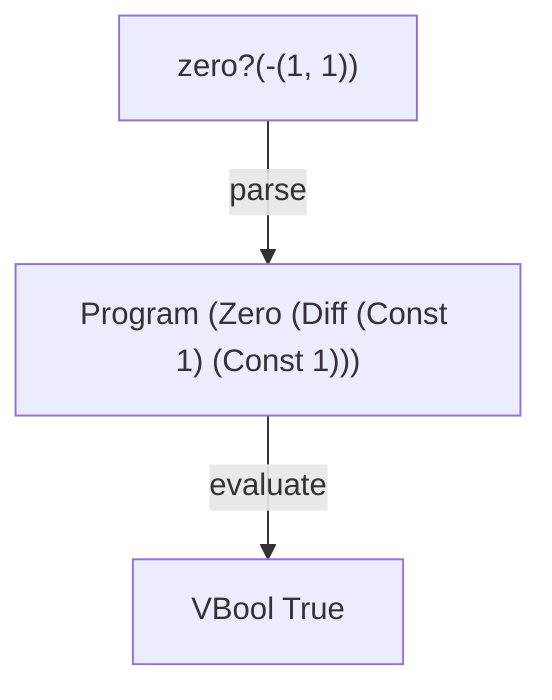

# ZERO

A tiny interpreter in Elm that adds the `zero?` predicate and shows how Boolean values introduce runtime type errors.

ZERO builds on [DIFF](https://github.com/tinyinterpreters/diff), where every expression evaluated to a number. With `zero?`, expressions can now produce either numbers or Booleans, so operations must check whether the values they receive are suitable for them.

Read [ZERO: Adding Booleans and Runtime Type Errors to a Tiny Interpreter in Elm](https://blog.tinyinterpreters.dev/posts/zero) for a guided explanation of how it works.



## Usage

You’ll need [Nix](https://zero-to-nix.com/start/install/) with flakes enabled.

Enter the development environment and start the Elm REPL:

```bash
nix develop
elm repl
```

Then run the interpreter:

```elm
import ZERO.Interpreter as I

I.run "zero?(-(1, 1))"
-- Ok (VBool True)
```

## Language

ZERO supports the constant and difference expressions from DIFF:

```txt
123
```

```txt
-(456, 123)
```

and adds the `zero?` predicate:

```txt
zero?(0)
```

```txt
zero?(-(1, 1))
```

`zero?` evaluates its operand and produces a Boolean:

```txt
zero?(0)
→ true

zero?(1)
→ false
```

Booleans can be produced by evaluation, but ZERO has no Boolean literals. `true` and `false` cannot be written directly as programs.

## Runtime errors

Before ZERO, every expression evaluated to a number. Adding Boolean values means an operation can now receive a kind of value it doesn't know how to use.

For example:

```txt
zero?(zero?(0))
```

The inner `zero?` produces a Boolean, but the outer `zero?` expects a number.

Similarly:

```txt
-(zero?(0), 1)
```

produces a Boolean where difference expects a number.

These programs are syntactically valid, but evaluation fails with a runtime type error.

ZERO represents runtime type errors with the types an operation expected and the types it actually received:

```elm
TypeError
    { expected = [ TNumber ]
    , actual = [ TBool ]
    }
```

## Tiny Interpreters

ZERO is part of [Tiny Interpreters](https://blog.tinyinterpreters.dev), where we learn how programming languages work by building tiny interpreters.
