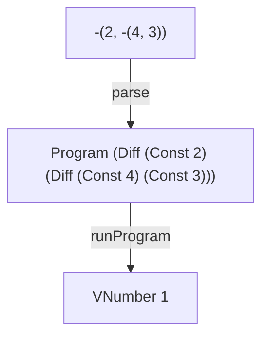

# DIFF

A tiny interpreter in Elm that evaluates recursive difference expressions.

Read [DIFF - Adding Recursive Expressions to a Tiny Interpreter in Elm](https://blog.tinyinterpreters.dev/posts/diff) for a guided explanation of how it works.



## Run it

You’ll need [Nix](https://nixos.org/) with flakes enabled.

```bash
nix develop
elm repl
```

Then, in the Elm REPL:

```elm
import DIFF.Interpreter as I

I.run "-(2, -(4, 3))"
-- Ok (VNumber 1)
```
