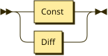
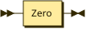

**Program:**


```
Program  ::= Expr
```

**Expr:**


```
Expr     ::= NExpr
           | BExpr
```

referenced by:

* Program

**NExpr:**



```
NExpr    ::= Const
           | Diff
```

referenced by:

* Diff
* Expr
* Zero

**Const:**


```
Const    ::= Number
```

referenced by:

* NExpr

**Diff:**


```
Diff     ::= '-' '(' NExpr ',' NExpr ')'
```

referenced by:

* NExpr

**BExpr:**



```
BExpr    ::= Zero
```

referenced by:

* Expr

**Zero:**


```
Zero     ::= 'zero?' '(' NExpr ')'
```

referenced by:

* BExpr

**Number:**


```
Number   ::= [0-9]+
```

referenced by:

* Const

## 
 <sup>generated by [RR - Railroad Diagram Generator][RR]</sup>

[RR]: https://www.bottlecaps.de/rr/ui